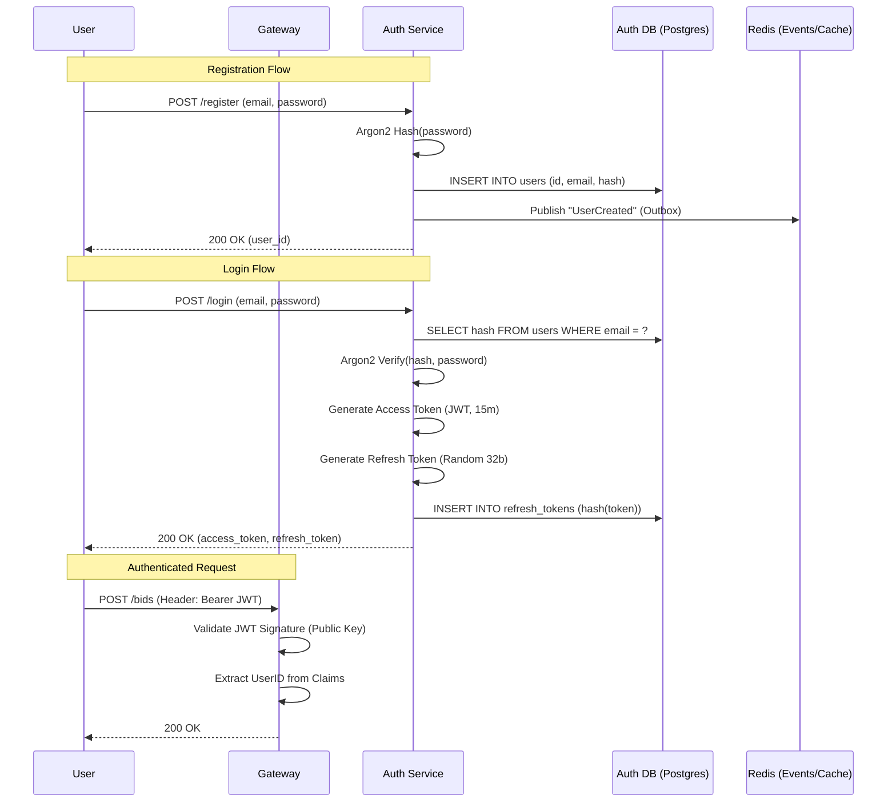

# Plan: Authentication (Phase 1 - Identity)

## Objective
Establish the **Identity Layer** of the Auction System. This phase focuses solely on **Authentication (AuthN)**: verifying who the user is, securely storing credentials, and issuing stateless tokens. We intentionally defer Authorization (Roles/Permissions) to Phase 2, but we will design the database to be forward-compatible.

## Architecture Diagram (AuthN Flow)



## 1. Database Schema (Forward Compatible)

We create the `users` table now. We will add `roles` later, but we ensure `users` is ready.

```sql
-- migration: 001_create_auth_schema.sql

CREATE TABLE users (
    id UUID PRIMARY KEY DEFAULT gen_random_uuid(),
    email TEXT NOT NULL UNIQUE,
    password_hash TEXT NOT NULL,
    full_name TEXT NOT NULL,
    created_at TIMESTAMPTZ NOT NULL DEFAULT NOW(),
    updated_at TIMESTAMPTZ NOT NULL DEFAULT NOW()
);

-- We store the SHA256 hash of the refresh token, not the token itself
CREATE TABLE refresh_tokens (
    token_hash BYTEA PRIMARY KEY,
    user_id UUID NOT NULL REFERENCES users(id) ON DELETE CASCADE,
    expires_at TIMESTAMPTZ NOT NULL,
    revoked BOOLEAN NOT NULL DEFAULT FALSE,
    created_at TIMESTAMPTZ NOT NULL DEFAULT NOW(),
    user_agent TEXT,
    ip_address TEXT
);

CREATE INDEX idx_refresh_tokens_user ON refresh_tokens(user_id);
```

## 2. Shared Library (`pkg/auth`)
We build the core crypto and middleware tools.

*   **`crypto.go`**:
    *   `HashPassword(password string) (string, error)` (Argon2id)
    *   `VerifyPassword(hash, password string) (bool, error)`
*   **`token.go`**:
    *   `GenerateAccessToken(user User) (string, error)` (RS256)
    *   `GenerateRefreshToken() (string, hash string, error)`
*   **`middleware.go`**:
    *   `AuthMiddleware(next)`: Parses `Authorization: Bearer ...`, validates signature, puts `userID` into Context.

## 3. Auth Service Implementation
*   **Location**: `services/auth-service`
*   **Tech Stack**: Go, ConnectRPC, pgx.
*   **API**:
    *   `Register`
    *   `Login`
    *   `Refresh` (Rotates the refresh token: issues a new one, revokes the old one).

## 4. Key Management
*   **Development**: On startup, if no keys exist, generate a new RSA 2048 pair and save to `/tmp/auth-keys`.
*   **Production**: Load from Kubernetes Secrets.
*   **Public Key Exposure**: The Auth Service will expose `GET /.well-known/jwks.json` (or just share the public key file via volume mount for now) so other services can validate.

## 5. Deliverables Checklist
- [ ] `api/proto/auth/v1/auth.proto` defined.
- [ ] `pkg/auth` library created with tests.
- [ ] `services/auth-service` scaffolded with Migrations.
- [ ] Login/Register flows working in integration tests.
- [ ] `bid-service` updated to use `pkg/auth` middleware (rejects anonymous requests).

