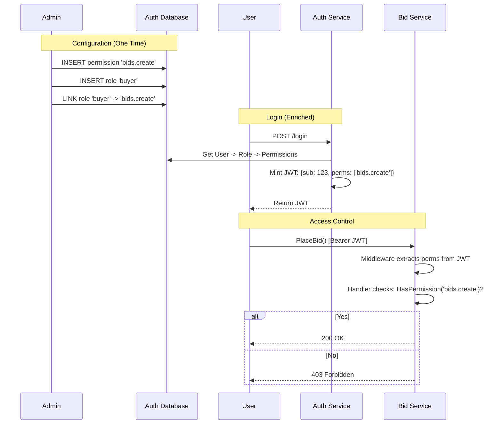

# Plan: Authentication (Phase 2 - Authorization)

## Objective
Implement **Role-Based Access Control (RBAC)** by adding permissions to the system. This builds on top of Phase 1 (Identity). We adopt a "Roles as Permission Templates" model, where services check *permissions*, not roles.

## Architecture Diagram (AuthZ Flow)



## 1. Database Migrations

We add the RBAC tables.

```sql
-- migration: 002_add_rbac.sql

CREATE TABLE permissions (
    id TEXT PRIMARY KEY, -- e.g., 'bids.create'
    description TEXT
);

CREATE TABLE roles (
    id TEXT PRIMARY KEY, -- e.g., 'buyer'
    description TEXT
);

CREATE TABLE role_permissions (
    role_id TEXT NOT NULL REFERENCES roles(id) ON DELETE CASCADE,
    permission_id TEXT NOT NULL REFERENCES permissions(id) ON DELETE CASCADE,
    PRIMARY KEY (role_id, permission_id)
);

-- Link users to roles
ALTER TABLE users ADD COLUMN role_id TEXT REFERENCES roles(id);
CREATE INDEX idx_users_role ON users(role_id);
```

## 2. Code Updates

### `pkg/auth`
*   **Update Claims**: Add `Permissions []string `json:"perms"`` to the JWT struct.
*   **Update Middleware**:
    *   Extract `perms` from the token.
    *   Store in Context.
    *   Add function `func HasPermission(ctx context.Context, perm string) bool`.

### `services/auth-service`
*   **Login Logic**:
    *   Perform a JOIN query to fetch all permissions for the user's `role_id`.
    *   Include them in the `GenerateAccessToken` call.
*   **Register Logic**:
    *   Assign a default role (e.g., `buyer`) to new users.

### `services/bid-service`
*   **Protect Handlers**:
    *   `PlaceBid`: `if !auth.HasPermission(ctx, "bids.create") { return PermissionDenied }`
    *   `CancelBid`: `if !auth.HasPermission(ctx, "bids.cancel") { return PermissionDenied }`

## 3. Seed Data
We need a migration or a seed script to populate the initial permissions.

*   **Permissions**: `bids.create`, `bids.read`, `items.create`, `items.read`, `items.update`.
*   **Roles**:
    *   `buyer`: [`bids.create`, `bids.read`, `items.read`]
    *   `seller`: [`items.create`, `items.update`, `items.read`, `bids.read`]
    *   `admin`: [*]

## 4. Deliverables Checklist
- [ ] Database migrations for RBAC tables.
- [ ] `pkg/auth` updated to handle permission strings.
- [ ] `auth-service` logic updated to fetch and embed permissions.
- [ ] `bid-service` enforcing permissions in handlers.
- [ ] Integration tests verifying a "Buyer" cannot "Create Items".

